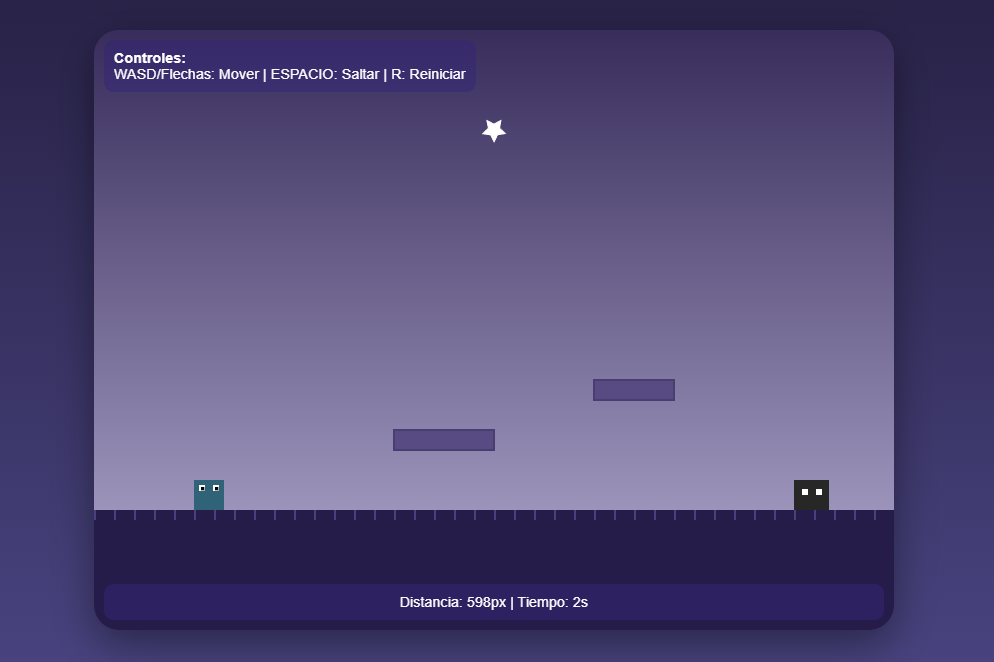

# ¡HUYE! — Mini Juego en JavaScript

**HUYE!** es un mini juego tipo *runner/platformer* desarrollado con **HTML, CSS y JavaScript**, donde debes moverte y saltar obstáculos mientras avanzas y sobrevives el mayor tiempo posible.

Este proyecto fue creado con el objetivo de practicar lógica de videojuegos, detección de colisiones, animación y control de eventos con JavaScript puro.

## Gameplay

El jugador controla un pequeño personaje que debe esquivar enemigos y plataformas mientras acumula distancia y tiempo de supervivencia.

Objetivo: **sobrevive y llega lo más lejos que puedas**.

  
  

## Controles

| Tecla | Acción |
|------|--------|
| **W / ↑ / Espacio** | Saltar |
| **A / ←** | Mover a la izquierda |
| **D / →** | Mover a la derecha |
| **R** | Reiniciar el juego |

## Tecnologías usadas

| Tecnología | Uso |
|-----------|-----|
| **HTML5** | Estructura del juego |
| **CSS3**  | Estilos y UI |
| **JavaScript** | Lógica del juego, animación, colisiones |

